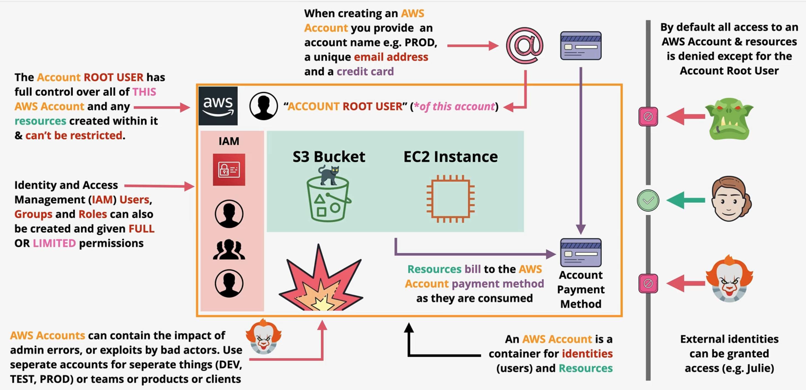

# AWS Accounts
- AWS Account != User
- AWS Account = container
- AWS Account = kind of like of a realm in KC, but they can be nested
- AWS account contains two types of entities -> identities and resources
- Every AWS account has a single root user, who cannot be deleted or restricted
- Root users from member accounts can have their credentials revoked, but user still exists
- Complex orgs use many accounts. They are nested and divided into OUs
- AWS account create -> name, email, credit card
- AWS account = strong container keep mistakes/hackers localized
- AWS account = isolation boundary
- By default all access to AWS account to external entities is DENIED, unless explicitly allowed. Except for root user.

Resource hierarchy is kind of like this:
Organization              (owned by the management account)                                                                                                                                                                     
└── Root                  (top OU node — a container, not an account)                                                                                                                                                           
├── Management account    ← lives here, usually directly under root                                                                                                                                                         
├── OU: Security                                                                                                                                                                                                            
│   ├── log-archive                                                                                                                                                                                                         
│   └── audit                                                                                                                                                                                                               
└── OU: Workloads                                                                                                                                                                                                           
├── OU: Prod → prd account → resources + IAM identities                                                                                                                                                                 
└── OU: Dev  → dev account → resources + IAM identities

┌───────────────────────────────────────────────┬────────────────────────────────────────────┐                                                                                                                                  
│                      GCP                      │                    AWS                     │                                                                                                                                  
├───────────────────────────────────────────────┼────────────────────────────────────────────┤                                                                                                                                  
│ Organization                                  │ Organization                               │                                                                                                                                  
├───────────────────────────────────────────────┼────────────────────────────────────────────┤                                                                                                                                  
│ Folder (nests)                                │ OU (nests)                                 │                                                                                                                                  
├───────────────────────────────────────────────┼────────────────────────────────────────────┤                                                                                                                                  
│ Project                                       │ Account                                    │                                                                                                                                  
├───────────────────────────────────────────────┼────────────────────────────────────────────┤                                                                                                                                  
│ Billing account (separate object, attachable) │ Billing rolls up to the management account │                                                                                                                                  
├───────────────────────────────────────────────┼────────────────────────────────────────────┤                                                                                                                                  
│ Organization Policy constraints               │ SCPs                                       │

Hierarchy notes:
- Organization is the massive UBER container
- The root is under it -> top of the OU hierarchy
- You can attach accounts directly to root or to OUs
- Account is always a leaf node
- Account sits inside exactly one OU (or directly under root)
- Account can hold nothing but resources and identities

## Root user
- Each AWS account needs a unique email
- You can use this subaddressing hack to use one real email for multiple accounts: klezovich+dev@gmail.com, klezovich+prod@gmail.com
- Each AWS account has an "account root user" tied to it -> tied to reg email
- Account root user has unlimited privileges and cannot be restricted
- All resources are billed to the root account credit card
- AWS is Pay-As-You-Go model -> also has a free tier

## IAM
- In AIM you can create users/groups/roles
- These can have full or limited permissions
- Every identity starts with 0 permissions. You need to explicitly give them

## Terminology
- Nested accounts are created via Organisations
- Management account = root account which owns the organisation
- Member accounts = accounts for dev/stg/prd
- So you have a concepts of Organizational Units (OUs) like folders, and member accounts are files
- IAM = identities and policies inside one account
- Organizations = account structure itself
- IAM Identity Center — workforce SSO across accounts. Its own service again, despite the name
- SCP = ServiceControlPolicy = maximum permissions available to an account