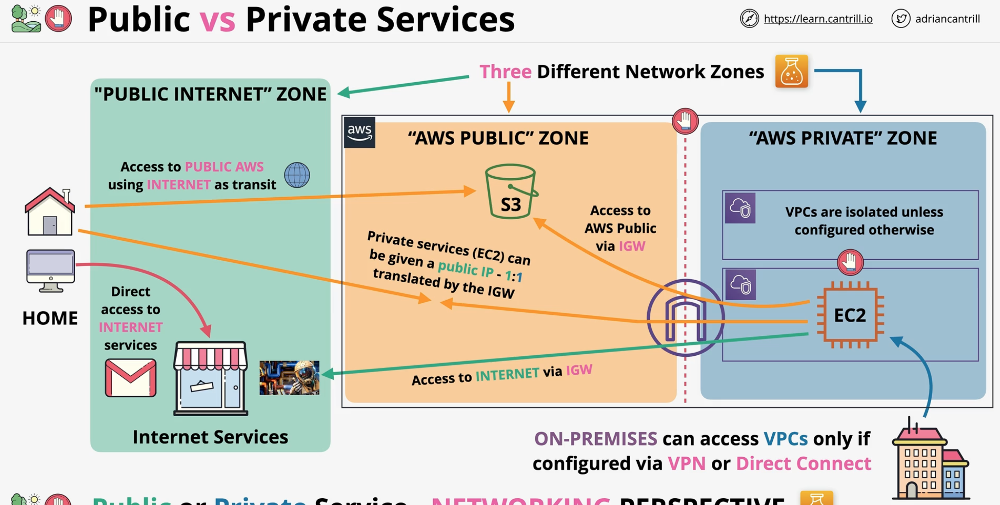
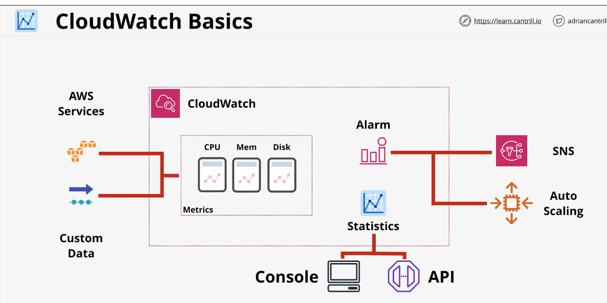
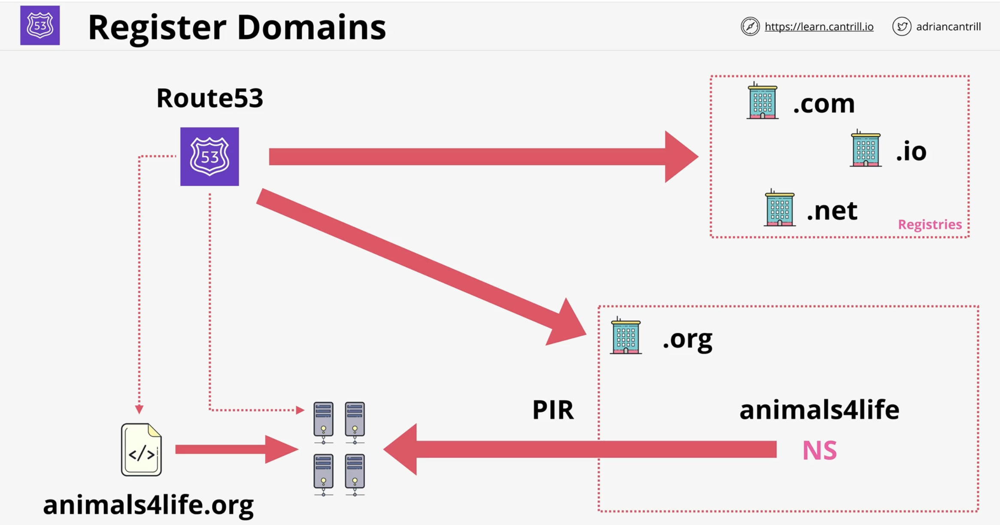

# Public vs Private Services
- Each service is born in the public zone or private zone. This is predecided for you by AWS.
- Public or Private service is networking perspective
- Private services live in a VPC
- Permissions vs Networking are two axis of public/private
- N.B. Public service means network reachability, not permissions
- IGW = Internet Gateway. Connects VPC to AWS Public zone and public internet. 1:1 relationship with VPC.
- The default VPC comes with an IGW pre-configured. If you delete it, no internet for the VPC.

## Service alchemy
- You can reach into a public service privately via a VPC gateway/interface endpoint -> traffic never goes to public internet
- You can expose a private service publicly by attaching an internet gateway to it and a public IP

Internet zones:
- Public internet
- Private internet -> VPCs
- AWS Public zone -> AWS public services live here (S3 as an example)
- VPCs are fully isolated and cannot talk to each other unless allowed
- Nothing can "reach into" a VPC unless allowed

# AWS Global Infra
AWS Global Infra = Regional Data Centers + Fast Global Networking

## Regions
AWS Region = Geographical zone in which there is full deployment of AWS services
AWS Regions = isolated fault domain. Protection from global disasters.
AWS Regions = isolated political domain. Data storage legal requirements and policy stuff. Forces data location for regulation.
AWS Regions = allows to place your stuff close to users
Most services -> live in a specific region, some like IAM are global

AWS regions -> has multiple AZs about 3-6
AWS Availability Zone -> isolated data centers per region. Protection from local disasters.
Your VPC spans multiple AZs.

AWS Edge Location -> much smaller than regions. Have content delivery service + some edge compute (much more than regions)
AWS Edge Location -> useful for Netflix -> fast streaming for users

Service resilience:
- Globally resilient -> one database, replicated accross all regions (IAM, Route53)
- Region resilient -> 1 set of data per region. replicate across AZs.
- AZ resilient -> 1 set of data per AZ. If AZ fails or specific hardware in it, service is down.

# AWS Default Private Cloud
Hierarchy: AWS Account -> Region -> VPC -> AZs -> Subnets
VPC = Region
Subnet = AZ

VPC = virtual private network inside AWS
VPC = lives in a specific region. Region-resilient. Spans multiple AZs.
VPC = private and isolated by default. Services inside can talk, but other VPCs and internet by default is banned.
VPCs = Default VPC (1 per region) + Custom VPCs.
Custom VPC = can configure how you want. You configure everything end-to-end. Private by default.
Default VPC = comes preconfigured in a very specific way. Easier, but less customizable.
VPC = allows to create private networks. Private services live here.
VPC = allows to connect to on-prem stuff and stuff in other clouds.

Custom VPCs can have multiple CIDR ranges
If AZ fails -> subnet in this AZ fails.
Default VPC can be deleted and recreated.
Some services assume default VPC exists.
Don't use default VPC for production stuff, because too inflexible.

Default VPC always has this:
- Default VPC has a single CIDR range -> 172.31.0.0/16 -> always same
- One /20 subnet(4096 IPs) per AZ. Each uses part of VPC CIDR range.
- IGW -> connects to internet.
- Security group
- NACL
- By default anything in default VPC(not custom) is given a public IP (subnets project themselves into AWS public zone)

# EC2 Basics
- Need to know REALLY well for the exam. Default compute service.

- EC2 = simple VPS. Should be default starting point for any compute workload.
- EC2 = IAAS. Instance is a unit of consumption. Instance = OS + some comput resources.
- EC2 = private service by-default. Runs in a single VPC subnet. Neet to configure public access if you want it.
- VPC needs to support EC2 public access. Default supports it by default, but for custom needs config.
- EC2 = AZ resilient.
- EC2 instances = has size and capabilities (like GPU). Some stuff you can change later, but some not.
- EC2 = you manage OS and upwards. 
- EC2 = on demand billing per second/per hour.
- EC2 charges = charge for CPU/memory, charge for storage, extra for commercial software instance runs with
- EC2 storage = local on-host storage, or EBS (network storage)
- EC2 has states -> Running, Stopped, Terminated(if you terminate irreversable stop) (some intermediate also exist)
- EC2 is always protected by an SSH key pair. There's a separate place to create those in AWS.

States and charges:
- Running = charges for all resources (compute,RAM,storage,network)
- Stopped = charges only for storage
- Terminates = charges nothing (disk deleted)

- AMI = Image of EC2 instance. Can create EC2 from AMI or AMI from running EC2.
- AMI = similar to Docker image
- AMI = contains the boot volume of the OS (/ or C:/) but maybe other drives
- AMI = contains block device mapping (determine which volume is the boot volume)

## AMI permissions
- AMI = has attache Permission. Determines who can use it
- Private AMI = only owner can use it.
- Public AMI = anyone can use it.
- AMI with permissions set by owner = determines who can use it

# S3 Basics
- S3 should be default INPUT to AWS services or output from AWS services (main data bridge)

- S3 -> a lot of AWS services use S3 for some stuff
- S3 should be the default storage service you think about

- S3 is a global storage platform -> buckets are regional based/resilient
- S3 regional bucket data never lives the region unless you explicitly configure it to do so
- S3 = public service
- S3 = unlimited data & multi-user
- S3 can be access via UI/CLI/API/HTTP

S3 concepts
- Objects -> files that are stored
- Buckets -> container for objects

S3 object
- Object = file
- Object ID = Bucket + Key
- Object parts = Object key (file-name) + Object value (binary data) + (VersionID, Metadata, AccessControl, Subresources)
- Object size from 0B to 5TB

S3 bucket
- Bucket = object container
- Bucket -> lives in a region (cant leave without permission, data sovereignty)
- Bucket is identified by a name -> must be GLOBALLY unique (most other stuff is region/account unique)
- Bucket can hold unlimited number of objects (infinitely scalable)
- Bucket has a flat structure !!! (not like FS with folder)
- Key structure can simulate a folder structure. Folders = prefixes

EXAM NOTE:
- Buckets are globally unique.
- 3-63 chars, all lowercase, no underscore
- Starts with an lowercase letter or number
- Can't be formatted like IP e.g. 1.1.1.1
- Soft limit: 100 per account, Hard limit: 1000 per account
- Unlimited objets, 0 bytes to 5TB
- Object = key + value + (other stuff)

S3 patterns and anti-patterns
- S3 = object store -> not file or block (no file system cant browse or mount in Linux)
- Great for large scale data storage, distribution or upload
- Great for offload. Push data to S3, instead of store it on EC2

# Cloud Formation (CFN) Basics
- Cloud Formation is like Terraform, but only for AWS

Template structure;
- Template = Resource + All other stuff
- Resource is the key section. Tells what to build. Only mandatory part.
- Other parts are helpers
- From template your create a stack. Stack = all logical resources template tells AWS to create.
- For every logical resource in the stack -> a physical resource is created

# Cloud Watch (CW) Basics

- Used by all others AWS services for ops/monitoring

CW jobs
- Collects and manages ops data
- Metrics -> collection, monitoring, actions based on them. CloudWatch agent can hook into on-prem stuff.
- Logs -> collect, monitor, take action based on logs. CW agent needed for non-exposed to AWS 
- Events -> AWS Services & Schedules. Based on event you can trigger actions. Also can do stuff on Schdule.

Notes:
- CW can also trigger alerts, write to SNS and trigger auto-scaling

CW concepts:
- Namespace -> container for monitoring data. AWS/EC2 -> all EC2 metrics. Keep orderly.

Metrics:
- Metrics = Time ordered set of data points
- Data-point -> each time server reports CPU utilisation. Datapoint = timestamp + value
- Dimensions -> additional info about the data-point. Dimension = name + value pair. Its like tags in DD.
- Dimension example: InstanceID=i-sdhsjdjh. You need dimensions to pick data-points for a specific service.

So its like this: Namespace -> Metric -> Set of Datapoints(timestamp, value, set of dimensions)

Alarms:
- Alarms are always triggered by a metric
- Alarm can have an action like send something to SNS topic or something more complex

# Shared Responsibility Model
- Determines who is responsible for which part of security on AWS
- AWS = responsible for security OF the cloud
- You = responsible for security IN the cloud

# HA, Fault Tolerance, Disaster Recovery
## High availability

- HA like a 4x4 in a desert -> spare wheel, duplicated drive
- Aims to ensure an agreed level of operational performance (usually uptime) for a higher than normal period
- When parts of the system fails -> it stays up: redundancy, automated self-healing
- HA = maximizing system's uptime
- HA -> small disruption not ideal, but acceptable
- HA = minimize disruption

## Fault-tolerance

- FT = System can continue operating properly when some of its its components fail
- In HA a small disruption is OK, in FT ZERO(!!) disruption
- FT much more complex to implement than HA. Costs much more
- FT = make disruption completely invisible

## Disaster recovery
- DR = what to do when HA & FT fail and need manual fix
- Set of policies&tools to enable the recovery or continuation of vital infra and system following a disaster
- DR = Pre-planning & DR Process
- Be prepared if shit hits the fan
- DR can be largely automated

# Route 53 Basics

Route53 = DNS as a service
Route53 = Registers Domains + Host Zones on managed nameservers
Route53 = Global service -> single DB -> globally resilient

You can also have private DNS linked to a VPC. For sensitive DNS records
Hosted Zone = Database which stores my DNS records
1 hosted zone = records for 1 domain

Domain registration
- Route53 has relationships with all top-level domain registries (handles .org or .com)

Reg process:
- Check with registar if domain is available
- Creates zone file -> file with all the necessary info about a particular domain (DNS record set basically)
- Zone file is stored on AWS name servers (4 of them)
- It tells .org managing people to reference AWS name servers for org.mydomain

# DNS Record Types