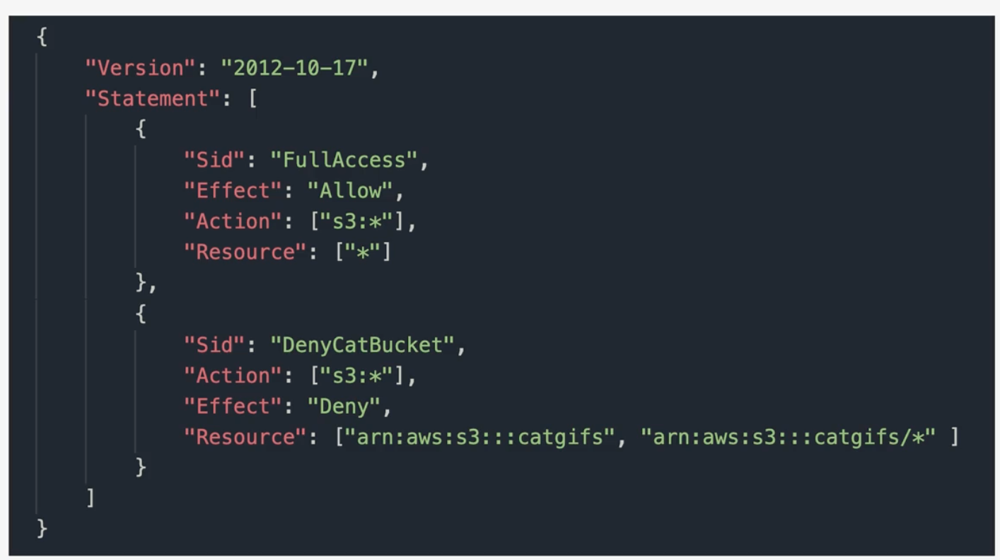
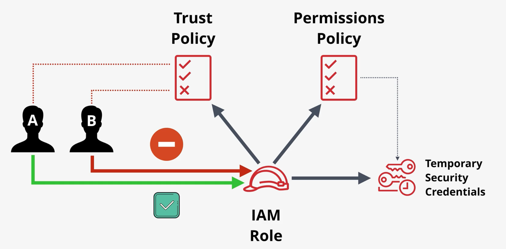
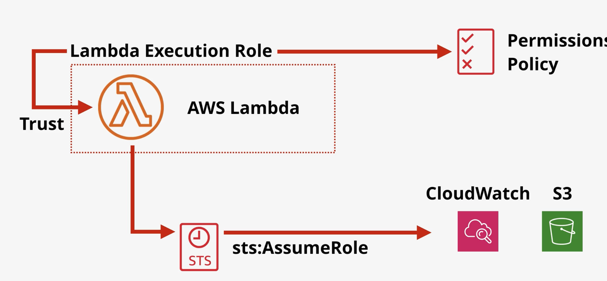
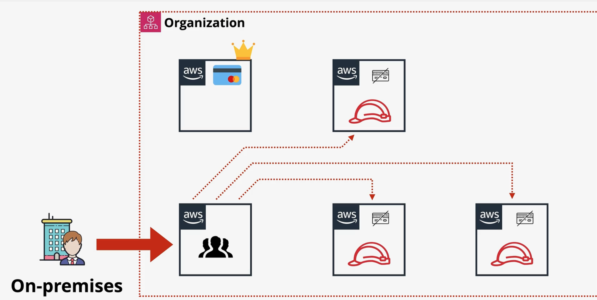
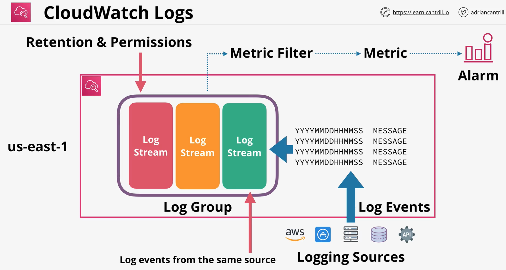
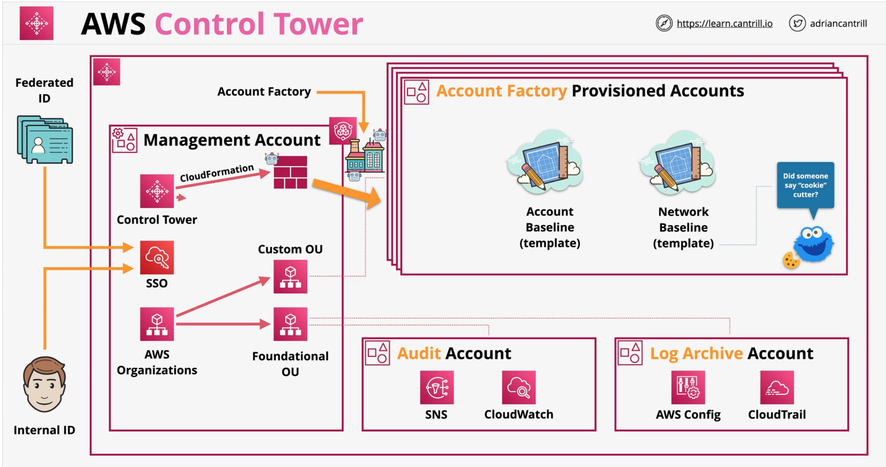

# IAM Core
- IAM is core IAM service, has STS as a sidekick to mint tokens
- For CLI/programmatic access = either use API key or STS issue token. No other options.

- Every request to AWS API goes to AIM for AN&AZ
- Request = Identity + Action + Resource
- If identity = root user, everything is allowed
- For every other identity by default everything is deny
- When a request is done all policies related to identity and resource are collected

Policy collection:
- On the resource there is 0+ resource policies (1:1) mapping. By default is implicit deny
- On the identity there are multiple policies(identity self->managed/adhoc) and from groups also
- All policies are collected and combined
- If there are conflicts, then resolved by Explicit DENY > Explicit ALLOW > Default DENY

Resource policies:
- 1:1 to resource
- References identities via ARN
- Resource policies CANNOT reference groups

Org stuff:
Control Tower > Organizations > OU > Accounts

# IAM identity policies

- Two policy types: identity-based and resource-based
- Resource policies -> get attached to resources (1:1 with resources, can't be shared)
- Identity policies -> get attached to identities (1:N with identities, can be shared)
- Identity policies = managed (1:N) or inline (1:1) (not scalable when for each user sep policies)
- Managed policies = AWS managed policies + Customer managed policies
- Inline policies = exception access rights override. Special case tool.
- Identity policies = set of ALLOW/DENY rules
- Identity policies = AZ of AWS
- You can attach multiple policies to an identity and they union. DENY always wins.
- Statement only applies if action + resource match
- Challenging part is reasoning through OVERLAPPING policies
- When a request is done: AWS policy engine collects all identity policies and a resource policy and merges them

Policy components:
- Policy = set of statements
- Statement = id(always name it), ALLOW/DENY, Action, Resource
- Action = service:action
- Resources -> identified by ARN
- Wildcards are allowed

# IAM users and ARNs
- IAM users = long-term access for users/apps/service account (for a single long term thing 99%)
- Principal needs AN(get identity) and AZ(list of policies which applies)
- Credentials = Username/Password + Access Key ID/Secret Access Key
- After AN process -> Principal -> Authenticated Identity

- ARN = unique identifier of a resource within an AWS account
- ARN = reference single resource or multiple with wildcards
- ARN used in IAM policies
- ARN struct = arn:partition:service:region:account-id:resource-type/resource-id (or :resource-id)

EXAM NOTES:
- 5000 IAM users per account
- IAM user can have 10 groups max
- 300 groups per account (but soft limit)
- IAM role and identity federation fix this

# IAM Groups
- Group are containers for user + policies (managed + inline)
- You CANNOT login to the group
- User can have at most 10 groups
- No limit on membership in groups. All 5000 users can be in one.
- There is no built-in "ALL USERS" group, but you can create one and manage it manually
- No NESTED groups. Only flat ones.
- Groups are kind of not a true identity

# IAM Roles 

- Role is an identity type. Can be referenced in resource policies
- Role = way to bind policies (managed or inline)
- Role to be used by an unknown number of entities (user or apps) or more than 5000 users
- Role is short access credential. You briefly assume a role.
- Role = short time identity representation
- Role = temporary security credentials (then need to reassume the role)
- STS generates short term creds for role

Role policy types:
- Trust policy -> WHO (this or other accounts, external stuff) can assume that role = AN
- Permissions policy -> standard thingy = AZ

# When to use IAM roles:
Services:
- Use roles for AWS services (AWS Lambda for example which starts/stops EC2 instances). Everything which is not an identity.
- Way better than give Lambda API keys

Emergency situations:
- helpdesk 99% read-only, but needs a break glass role to fix some urgent customer issue
- Emergency role concept

Existing customer environment and existing IdP:
- Microsoft Active Directory -> more than 5K users
- Give to active directory users a special Role they can assume
- This is called Id federation

Existing mobile/wab app:
- App has 1 000 000 users
- Use web identity federation, link role to external account

Cross account access:
- Your account and partner AWS account
- You have 1000 of accounts in your account, create a role in partner account and allow for it to upload to their S3 bucket

# Service-linked roles and PassRole
Service-linked role
- Service linked role is a type of AWS role
- Service-linked role is linked to specific AWS service
- Its set of permissions is PREDEFINED by the service which define reqs to interact with other services
- Service might create/delete role or you define it during the setup or withing IAM
- Can't DELETE the role until its no longer required

PassRole permissions
- Role separation
- Permission which allows to assign roles to services
- Otherwise can give admin to EC2, ssh into it and run the world

# AWS Organizations

- Organization = easy to manage multiple accounts
- Organization = container for accounts

Org process:
- Take a standard account and create an Org within it 
- The account which created Org, becomes the management account for it  
- Then you can invite other standard accounts (and they become member accounts)
- Also create new accounts directly in Org
- Organize this stuff using OU
- Organization Root -> root of the org structure -> can contain accounts
- And from root below you use Org Units
- Org have consolidated billing -> management account does all the billing (payer account)

- Single IAM user pool, and for every account you have role
- You use a special member account just to manage logins (can integrate with external IdP -> role switch mechanism)

# Service Control Policies (SCPs)
- SCP = massive blanket ban !!!
- SCP = restrict what various accounts in an Org can do
- SCP = policy document
- SCP = feature of AWS organisations
- SCP = attach to ORG/OU/Account (affects whole subtree)
- SCP two styles = Deny list(default) or Allow list(harder). FullAwsAccess -> default SCP
- Management account is NEVER affected by SCPs. Don't run workloads here
- SCP policies can restring root users for the account. ONLY THING.
- SCP don't grant permissions. They just limit bounds of allow/deny.

# CloudWatch Logs

- СloutTrail will pump logs to CloudWatch
- CloudWatch -> public service, regional

- Store/Monitor/Acess logging data
- Log -> timestamp + data
- Has tons of integrations 
- CloudWatchAgent can pull in logs from other thingies
- Also with AWS SDK you can pump logs there directly
- Can generate metrics based on logs -> metrics filter
- Log events(timestamp + string) are stored in log steams (from same source)
- Log groups -> container for log steams for similar stuff. Retention settings/permissions are stored here
- Metrics are defined on log groups -> increment metrics -> alarms

# CloudTrail
- CloudTrail -> regional service, but can also apply to all regions
- CloudTrail -> logs API actions which affect AWS accounts
- API call -> CloudTrail event
- Stores 90 days in event history (enabled by default, 90 days for free, no S3(!!))
- If you want to customize need to create a Trail (unit of config)
- Events = Management events(create EC2/terminateEC2) + Data events(object uploaded/read from S3)
- Global Service Events -> need to be enabled
- Events are logged to region or global events go to us-east-1 (need to be enabled on a trail)
- Data events need to be explicitly enabled
- Custom Trails are stored in S3 bucket -> can also push to CloudWatch logs (powerful!!)
- Organization Trail -> single management trail (very powerful)
- Only Management events are stored by default (Data events cost extra)
- CloudTrail ~ some minute delay or so ... NOT real time

# AWS Control Tower

- Control Tower = Resource architecture -> via CFN stacks
- AWS account = sets up Accounts/OUs/SCP -> quick and easy setup of multi-account environment
- Control Tower -> evolution of Organisation features
- CT -> create from management account

Features:
- Landing zone -> multi-account environments -> SSO/Federation/Centralized Logging and Audit -> Key thingy
- Guard rails -> Detect/mandate rules/standards accross the whole org
- Account Factory -> standartizes account craetion
- Dashboard -> high level 