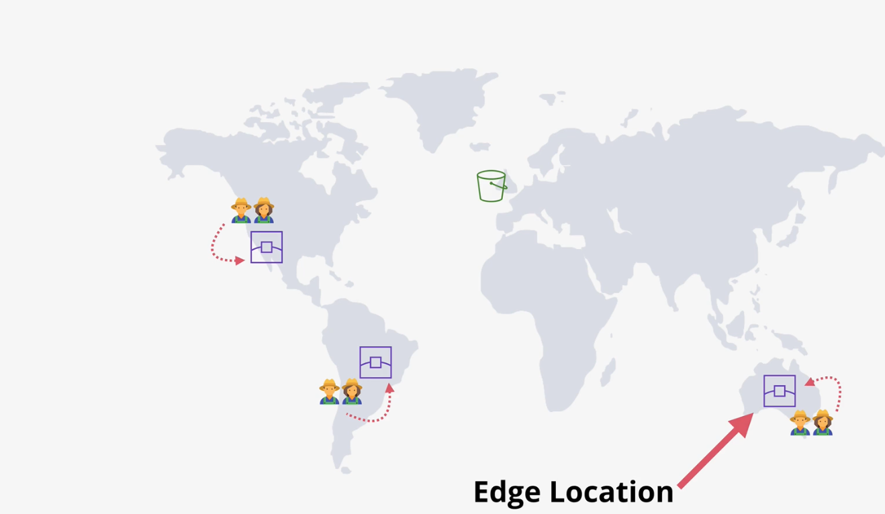
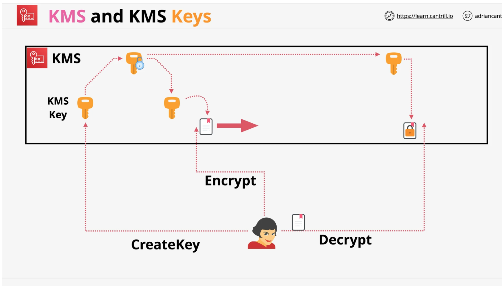
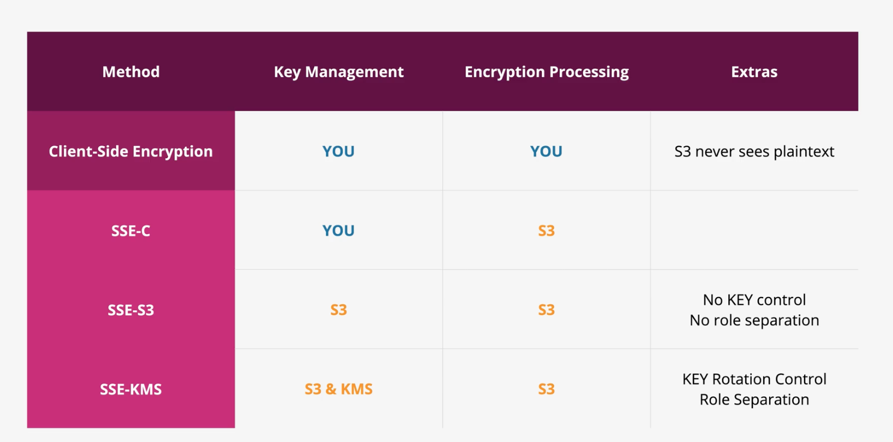
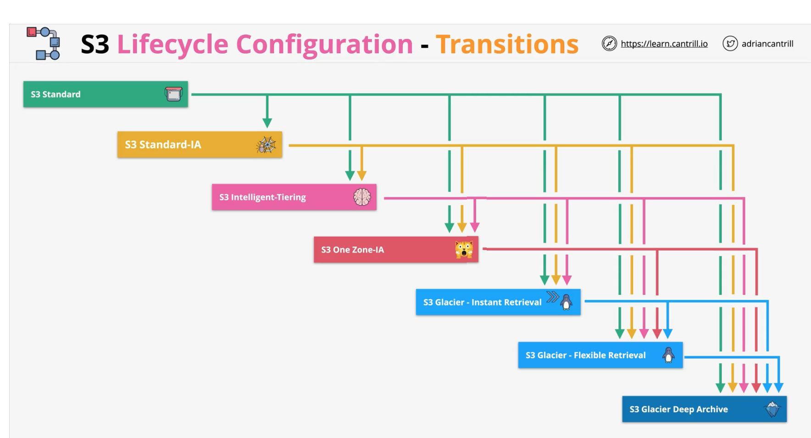

# S3 General notes
- Main use case: read/write objects to bucket
- Access control
- Versioning
- Encryption
- Storage classes & lifecycle
- Hosting a static website

# S3 Security
- Block Public Access -> key setting on bucket/account level -> overrides everything

Key objects
- Resource policies
- ACLs
- S3 is private by default. By default only root has access

## Resource policies
- Resource policy = who can access this resource
- Identity policy limitation - apply only to their account
- Resource policy = anon access + access set to other accounts
- Resource policy CRUX = Principal field
- Can only be applied at the bucket level

Cool factors:
- Can deny access based on IP
- Restrict access only to MFA users

## ACLs
- Legacy concept, not recommended
- ACL acts on buckets and objects
- Inflexible and simple permissions

# S3 Static hosting
- By default AWS S3 is accessible via AWS API
- Can also allow access via HTTP -> can host almost anything
- To use: enable and set index.html page and error.html page
- When a bucket is used in this mode a website endpoint is created
- If want match with custom domain -> the bucket name really matters

S3 static hosted use cases:
- Offloading -> put media, static content on S3 and then EC2 with server just redirects to it (serve media from S3)
- Out-of-band pages -> put a maitenance/status page there and point DNS there during maintenance phase 

S3 costs:
- Storage cost
- Transit fees -> in(free), out costs a bit
- Small costs per 1000 ops for any operation

# Object versioning and MFA Delete
- Without versioning value is object, with versioning value is map of objects
- Versioning = store multiple versions of objects within a bucket
- Versioning states: Disabled, Enabled, Suspended (versioned past, unversioned present)
- Versioning = controlled on bucket level. Disabled by default. Once enabled CANNOT be disabled.
- An bucket with enabled versioning can be suspended and once suspended can later be enabled.
- Operations which would modify an object just create a new version
- Versioning adds a new part to the key, you also get versionId, so item id becomes (key, versionId)
- With versioning -> a delete marker is added and the object LOOKS deleted without being actually deleted
- You can delete the delete market and object is back
- True deletion is available if you give versionId for delete operation
- With versioning: spaced is consumed by ALL versions -> you are billed

- MFA delete -> part of versioning configuration
- MFA delete = MFA is required to change bucket versioning state AND MFA is required to delete versions

# S3 Perf Optimisation
Features:
- S3 Put Object -> default single data stream to S3 (if fails then need to restart whole thing)
- Fast upload/download is better done via multiple streams
- Max object = 5Tb, but max single put is 5Gb (solved via multipart thingy)

Multipart upload:
- Breaks up blob and uploads part. 100Mb is minimum size. Autoused by AWS tooling.
- Max 10,000 parts. 5Mb -> 5Gb. Parts can fail, but only the failed parts is restart
- You get better transfer rates.

S3 accelerated transfer:
- Default path can be inefficient on public path
- Use edge locations to speed this up
- A bucket needs to be enabled for accelerated transport and then can use that feature
- Once turned on gives you a special accelerated endpoint

# KMS

- KMS allows you to create and manage encryption keys. Also control their use by AWS services.
- KMS is a regional and public service. Needs perms to access it.
- KMS keys are stored per region and never leave (but multi-region replication is available)
- KMS keys are AWS owned(kind of background) or customer owned.
- Customer owned = AWS managed(automatically created when S3 maybe needs them) or Customer managed(explicitly created)
- Customer managed keys are more configurable
- KMS keys support rotation
- Use by S3 to store keys to encrypt files at rest.

- KMS = symmetric and assymetric keys
- KMS = enc/dec, sign/verify 
- Keys never leave KMS -> FIPS 140-2 certified (L2) -> really important (EXAM NOTES)

Further talking about symmetrics keys
- KMS manages KMS keys as logical objects
- KMS key = ID, date, policy, desc, state, physical key material (generated/imported)
- KMS key can encrypt/decrypt 4Kb at stuff at most

How do you overcome this 4Kb at most ecnrypt limit ?
Data encryption keys (DEK) -> generated from KMS key -> can work with data more than 4Kb
DEK linked to generated KMS key

When DEK is generated you get 2 things
- Plaintext DEK version -> can do enc with it
- Ciphertext DEK version -> given back to KMS
- You do this: enc with plaintext version, throw it away, store enc DEK version with data, then give this version to KMS with data
- And then KMS decrypts the DEK key and you can use it to decrypt data
- S3 generates a new DEK for each object

Key policies
- KMS is very special in terms of its policies
- Every key has a resource policy. Cannot without it. Key need to explicitly allow access to it.
- Keys need to be told that they trust the account they exist in.
- Typical case: key resource policy allows use in account and then identity policies also allow its use to identities
- There is also some stuff related to Grants

# S3 Object encryption

S3 provides several encryption options
- Server-side
- Client-side

- Buckets aren't encrypted, objects are
- Each object can have separate encryption settings

Server side encryption notes
- S3 receives plaintext object, and encrypts it

Server side encryption options 3:
- SSE-C -> if you want to manage keys yourself. just offload CPU to S#
- SSE-C -> you provide the key for encryption (key is sent with request?) -> encryption CPU load is offloaded to 
- SSE-C -> on decrypt you also need to send the key. Key hash is stored on encrypt.

- SSE-S3 -> default one, default S3 key is used for encryption. An object key is created per object.
- SS3-S3 -> an encrypted version of object key is stored with object. KMS S3-key used to decrypt it and then object.
- SS3-S3 -> can't prevent S3 admin from reading objects

- SSE-KMS -> like the one above, but you use a different key from KMS, which you pick.
- SSE-KMS -> significant change. because you use a custom KMS key, much more flexibility.
- SSE-KMS -> role separation. S3 admins cannot read objects.

Client side encryption notes
- Objects are encrypted in client side
- You fully own encryption end-to-end

# S3 bucket keys
- S3 bucket keys = a cache that stops S3 calling KMS once per object. Faster and cheaper
- KMS is used to generate a bucket key, which then creates DEKs on side of S3. No calls to KMS.
- You will see less stuff in KMS logs
- Works with replication
- If plaintext object is replicated to a bucket with bucket keys, then object become encrypted (ETag changes)

# S3 storage classes
- S3 standard -> default one (stores across 3 AZs) -> 200 response = storage durably. Can chill. Default pricing applies.
- S3 standard -> frequently used data, which needs to be durable and accessible

- S3 standard-IA -> infrequent-access. pretty much the same, 50% of the cost. Retrieval fee(+transfer). Costs more to access.
- S3-standard-IA -> min duration fee of 30 days. Min billing applies. Min 128Kb object billed.

- S3 one zone-IA -> similar to above. Stored in only one AZ. Data can be lost a bit if AZ falls.

S3 Glacier:
- S3 Glacier Instant -> cheaper storage, more expensive retrieval(longer minimum). Instant access.
- S3 Glacier Flexibile -> 1/6 of std class cost. Cold objects. Need an access request, job needs to be run has a cost. This is for archives.

Retrieval types:(faster = more expensive)
- Instant 1-5 mins
- Standard 3-5 hours
- Bulk 5-12 hours

S3 Glacier deep archive:
- Much cheaper. Even harder retrieval. 12-48 hours retrieval time.

S3 Intelligent-tiering:
- Five storage tiers. This thingy automatically moves stuff between tiers.

# S3 lifecycle config

- S3 lifecycle config = move stuff between storage classes based on some config
- You create rules which move an object between tiers
- Rule = action + condition. Apply to a bucket or object group.
- Action = transition action + expiration action(delete objects). Can move on versions also.
- TRANSITIONS ONLY EVER GO DOWN. CANT GO UP !
- Smaller objects when they go down can cost more.
- Minimum 30 day storage in STD class, before it goes into infrequent-access. And then 30 days until it can go to next class.

# S3 replication
- S3 replication = copy objects from one bucket to another. Same or different region.

Replication options:
- Cross-region replication(CRR)
- Same-region replication(SRR)

- Replication config applies to the source bucket
- Config: target bucket + role to use
- If replication between accounts, then target account target bucket must have resource policy which allows the push

Replication configs:
- All objects or a subset in a bucket.
- Which storage classes to use. Default is to maintain.
- Ownership. Default is source account. Can override for cross-account.
- Replication time control. RTC -> 15 minute SLA.

Notes:
- Replication is not-retroactive & versioning needs to be on (src&dest)
- Batch replication can move existing object
- One way replication only (can be made so new feature)
- Can move stuff with various encryption settings (SSE-KMS with extra config)
- No system events, Glacier, Glacier Deep Archive -> this don't replicate
- NO DELETE -> deletes are not replicated (but can enable)

UCs:
- Log aggregation
- PRD & TEST sync
- SRR -> resilience with sovereignty. Move to separate account.
- CRR -> global resilience improvements
- CRR -> Latency reduction

# S3 presigned URL
- S3 presigned url = grant temporary access for a given resource/operation to person without any creds
- Implemented with `aws s3 presign`
- Can give access to stuff in a fully private bucket
- Presign URL and allow download and upload of objects

EXAM NOTES:
- You can create a URL for an object you have no access to. Object won't open though
- On use URL permissions are equivalent to idenity which generated it. 
- Access denied -> never had access ot maybe had before, but not now
- Don't use with a ROLE. URL stops working when temporary credentials expire.

# S3 Select and Glacier Select
- S3 select -> run some SQL over an object (CSV/JSON/Parquet file) and get onlu resulting rows
- Glacier select -> same thing but over Glacier and result is written to S3
- Note its only for old accounts. For new accounts use Athena
- You pay only for consumed part

# S3 Events
- S3 events = notifications when something happens to an object. Can configure this for which events and where.
- You can send them to one of S3 integration services
- Just link EventNotificationConfig to a bucket
- Mostly use EventBridge

# S3 Access Logs
- You can log everything which happens to a bucket and store it in a different S3 bucket
- S3LogDeliveryGroup -> slowly moves stuff there. Needs permissions.
- You manage lifecycle of logged stuff.

# S3 Object Lock
- Once an object version is locked, can't be overwritten or deleted until lock expires

Two protections:
- Fixed "Retain until date" set per object or on bucket level. Can be extended, never shortened.
- Legal hold. Indefinite stays until someone removes it.

Two modes:
- Governance. Most users are blocked, but a principal with s3:BypassGovernanceRetention can delete or shorten
  it
- Compliance. "The only way to delete an object under the compliance mode before its retention date expires is to delete the   
  associated AWS account."

Use cases:
- Immutable audit trail
- Ransomware/hacker/insider protection

# S3 Access Points
S3 Access point = A named front door to a bucket: its own hostname, its own policy
- Often when many teams have access to S3 bucket, resource policy becomes too complex
- Solution: each team gets its own access point (URL), with own resource policy
- Optionally an access point can be allowed from a specific VPC
- Note: both access point policy and bucket resource policy must allow the request