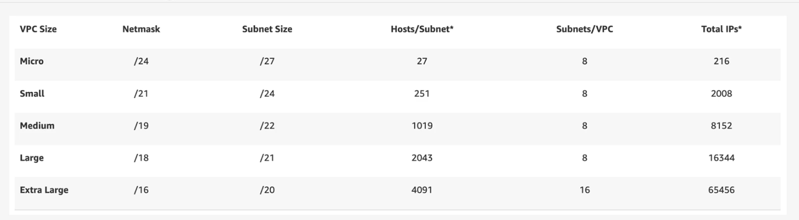
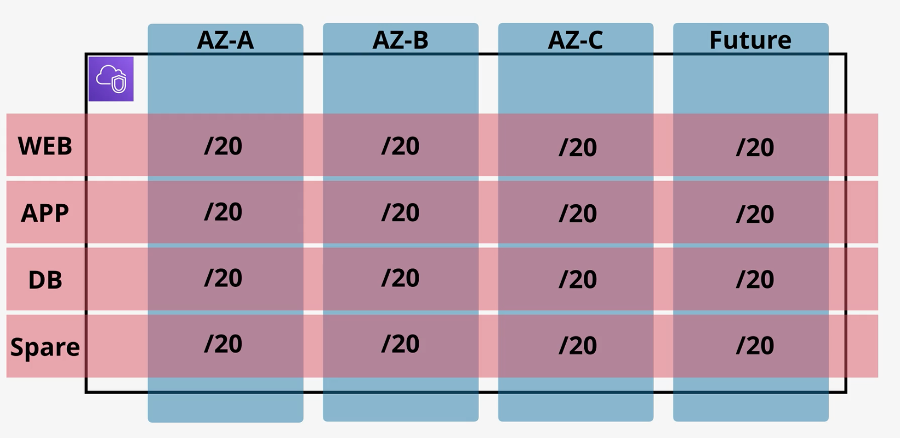
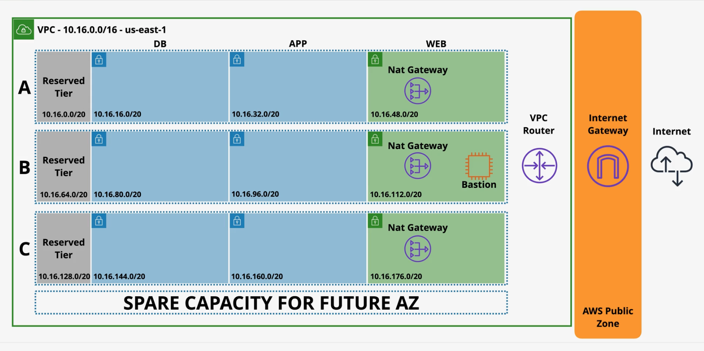

# VPC

# VPC Sizing And Structure
- Everything starts with creating an IP address plan
- When you define VPC IPs you are picking private ones from private IP space (RFC1918)
- These guys are not routable from the internet.

Starting points for VPC design:
- VPC -> first and most critical decision -> CIDR (you can use several later)
- What size does your VPC need ?
- What other networks VPC needs to talk to ? VPCs, Cloud, On-prem, Partner&Vendors. AVOID OVERLAP !
- Try to predict the future.
- VPC Structure -> Tiers, Resiliency(AZs)

Thought process:
- Avoid IP ranges in use by other parts of the business. Key thing !!
- VPC mininum/28 -> 16 IPs, Maximum/16 -> 65k IPs
- Best idea is to use 10.x.y.z range -> and each one is like 10.1.x.y/16, 10.2.x.y/16 ... 10.255.x.y/16
- Avoid common ranges = avoid future issues. Avoid 10.0.x.x(common) and 10.1-10.x.x(everyone picks to avoid 0) 
- So 10.16.x.x is a good start and then use base-2 numbers
- Then think of the number of regions the biz will operate in EVER. Add 1-2 as buffer
- Reserve 2+ networks per region. being used in the account

Key questions:
- How many subnets you need per VPC ? 
- How many IPs you need total/per subnet ?
- How many AZs will your VPC use ? Starts with 3 as defaults, but add 4 -> VPC splits into 4
- Then add use 3+1 tiers

And this is kind of the subnet structure

# Custom VPCs

- VPC = isolated network. closed box by default. nothing goes in or out unless explicit conifg
- Set of VPCs in region = set of isolated networks
- Flexible config -> simple or multi-tier
- Hybrid networking -> allow to connect to on-prem workloads
- Default or Dedicated tenancy -> shared vs dedicated hardware (pick default mostly)
- VPC gets IPv4 Private CIDR and Public IPs for some resources
- VPC -> one main private CIDR, can have additional ones up to about 5
- Can add support for IPv6. AWS gives you a pack or you bring your own.
- IPv6 is publicly routable by default. But you do need to publicly allow connectivity.
- DNS auto-provided by route 53 and available at VPC `Base IP + 2` address
- enableDnsHostnames -> do EC2 instances get DNS hostnames
- enableDnsSupport -> instances get DNS IP address (enabled at all??)

# VPC Subnets

# VPC Routing, IGW, Bastion Hosts

# Stateful vs Stateless firewall
- Stateful FW -> remembers connections. Allow the outbound request and response is permitted. (SG, Ephemeral ports OK)
- Stateless FW -> does not remember connections. Must explicitly allow all. (NACL, Ephemeral ports must be allowed)

# NACL
- NACL is 1:1 to subnet. Subnet must have one.
- If NACL isn't given one by default, it inherits the one from the VPC. If changed at VPC level, automatically changes for all.
- Default NACL is permit all

# SG
- Security groups are applied at ENI level. Several are stacked. Always allow rules only.

# NAT and NAT Gateway
- NAT allows outbound connections, but not inbound
- Useful to allow stuff in VPC to get updates, but keep the stuff inside the VPC hidden