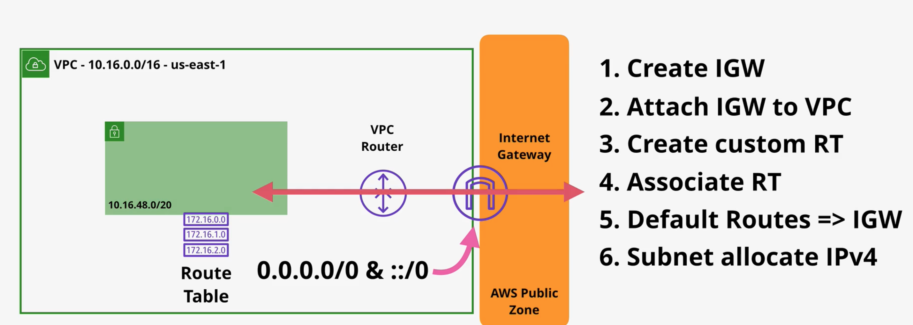

# VPC

# VPC Sizing And Structure
- Everything starts with creating an IP address plan
- When you define VPC IPs you are picking private ones from private IP space (RFC1918)
- These guys are not routable from the internet.

Starting points for VPC design:
- VPC -> first and most critical decision -> CIDR (you can use several later)
- What size does your VPC need ?
- What other networks VPC needs to talk to ? VPCs, Cloud, On-prem, Partner&Vendors. AVOID OVERLAP !
- Try to predict the future.
- VPC Structure -> Tiers, Resiliency(AZs)

Thought process:
- Avoid IP ranges in use by other parts of the business. Key thing !!
- VPC mininum/28 -> 16 IPs, Maximum/16 -> 65k IPs
- Best idea is to use 10.x.y.z range -> and each one is like 10.1.x.y/16, 10.2.x.y/16 ... 10.255.x.y/16
- Avoid common ranges = avoid future issues. Avoid 10.0.x.x(common) and 10.1-10.x.x(everyone picks to avoid 0) 
- So 10.16.x.x is a good start and then use base-2 numbers
- Then think of the number of regions the biz will operate in EVER. Add 1-2 as buffer
- Reserve 2+ networks per region. being used in the account

Key questions:
- How many subnets you need per VPC ? 
- How many IPs you need total/per subnet ?
- How many AZs will your VPC use ? Starts with 3 as defaults, but add 4 -> VPC splits into 4
- Then add use 3+1 tiers

And this is kind of the subnet structure

# Custom VPCs

- VPC = isolated network. closed box by default. nothing goes in or out unless explicit conifg
- Set of VPCs in region = set of isolated networks
- Flexible config -> simple or multi-tier
- Hybrid networking -> allow to connect to on-prem workloads
- Default or Dedicated tenancy -> shared vs dedicated hardware (pick default mostly)
- VPC gets IPv4 Private CIDR and Public IPs for some resources
- VPC -> one main private CIDR, can have additional ones up to about 5
- Can add support for IPv6. AWS gives you a pack or you bring your own.
- IPv6 is publicly routable by default. But you do need to publicly allow connectivity.
- DNS auto-provided by route 53 and available at VPC `Base IP + 2` address
- enableDnsHostnames -> do EC2 instances get DNS hostnames
- enableDnsSupport -> instances get DNS IP address (enabled at all??)

# VPC Subnets
- Subnets = internal structure of the VPC
- By default subnets = private, can be made public
- Subnet = AZ resilient. 1 permanent AZ assignment
- 1 subnet = strictly ONE permanent AZ.
- 1AZ = 0+ subnets
- Subnet CIDR = Subset of VPC CIDR. No subnet OVERLAP !
- Can get /64 range of IPv6 from /56 VPC optionally.
- Subnets can by default communicate with ALL other subnets in the VPC
- Some IPs in the subnet are reserved. 5Ips are always reserved !

Reserved for CIDR 10.16.16.0/20
- 10.16.16.0 -> network address
- 10.16.16.1 -> VPC router
- 10.16.16.2 -> DNS use
- 10.16.16.3 -> Future use reserved
- 10.16.31.255 -> last in CIDR block. Broadcast address.

- VPC has a DHCP option set -> automated IP allocator
- One DHCP option set per VPC -> auto applied to a subnet
- Can create new, but not edit DHCP option sets

- Can turn on turn on public IP allocation on subnet level
- Can turn on auto-assign auth-assing of IPv6

# VPC Routing, IGW, Bastion Hosts
- Every VPC has a VPC router -> highly available. Has interface is every subnet. Moves stuff in VPC.
- VPC has a main route table. Can override per subnet. Subnet has exactly 1 route tables.
- Routing tables are attached to 0 or more subnets.
- With route tables outbound IP is matched according to leading prefix match. /x -> this is indicator
- Traffic either stays local or goes to IGW
- All route tables have at least the local route, which routes within the VPC. Same for IPv6 ips.
- Local route always wins if can. Uber route

IGW:
- Regionally resilient. Don't need one per AZs.
- IGW:VPC 1:1. VPS has 0+ IGW. IGW has 0 or 1 VPCs attached to it.
- IGW runs from the AWS public zone
- So there is a process to integrate an IGW into a VPC
- Public IP for an EC2 instances is not stored in EC2 OS, purely IGW setting
- So IGW is kind of like a NAT thingy

- Bastion host = Jumpbox. Instance in a public subnet you can SSH into.
- From there you can ping stuff using local IPs for VPC
- This is old school, new school is Session Manager
- Used as management point, or entry-point for like on-prem stuff

# Stateful vs Stateless firewall
- Stateful FW -> remembers connections. Allow the outbound request and response is permitted. (SG, Ephemeral ports OK)
- Stateless FW -> does not remember connections. Must explicitly allow all. (NACL, Ephemeral ports must be allowed)

# NACL
- NACL = traditional firewall
- NACL works on subnet boundary. Stuff inside subnet not affected.
- Inbound rules and outbound rules. Work on IP traffic level. NACL not known if request/response.
- Offer explicit allow and deny rules.
- Start with lowest number and works until matching rule found. Then decision is made. ONE MATCH !!
- * rule = explicit deny
- NACL is 1:1 to subnet. Subnet must have one.
- If NACL isn't given one by default, it inherits the one from the VPC. If changed at VPC level, automatically changes for all.
- Default NACL is permit all
- You can create custom NACLs and associate with subnets

EXAM NOTES:
- UC: Allow to ban bad IP ranges/nets
- NACLs can only be assigned to subnets
- Requset and response diff
- Only for subnet boundaries
- NACLs between 2 subnets -> need to work for every subnet
- NACL can explicitly allow and deny
- IPs, CIRD, ports and protocols -> not aware of any logical resources
- NACL can be associated with many subnets

# SG
- Security groups are applied at ENI level. Several are stacked. Always allow rules only.
- They are stateful. Automatically allow responses. Way better management.
- No explicit DENY. Implicit DENY always in action. 
- Cannot block specific IP address range
- Higher level than NACLs. Support IP/CIDR but also logical resources including other SGs and ITSELF
- Attached to ENIs always, not to instances (!!)
- If request is allowed, then response is implicitly allowed. 

Advanced stuff:
- Logical references -> reference instances with a given SG and allow access from them. Good for scalability.
- Self-references. Can allow free comms between instances with the same SG. Maybe all apps within the app tier.

# NAT and NAT Gateway
- NAT allows outbound connections, but not inbound
- Useful to allow stuff in VPC to get updates, but keep the stuff inside the VPC hidden