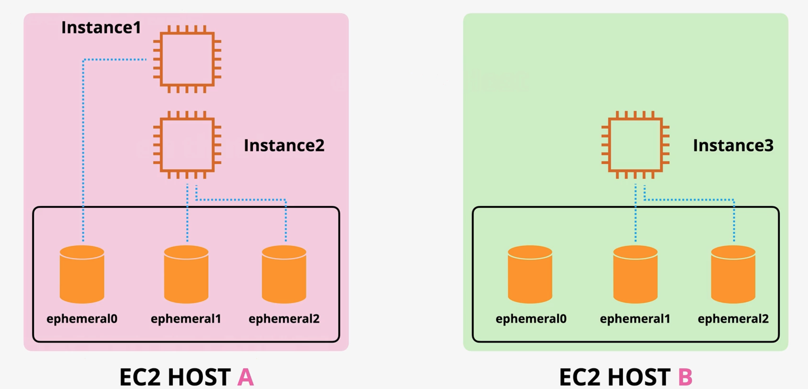
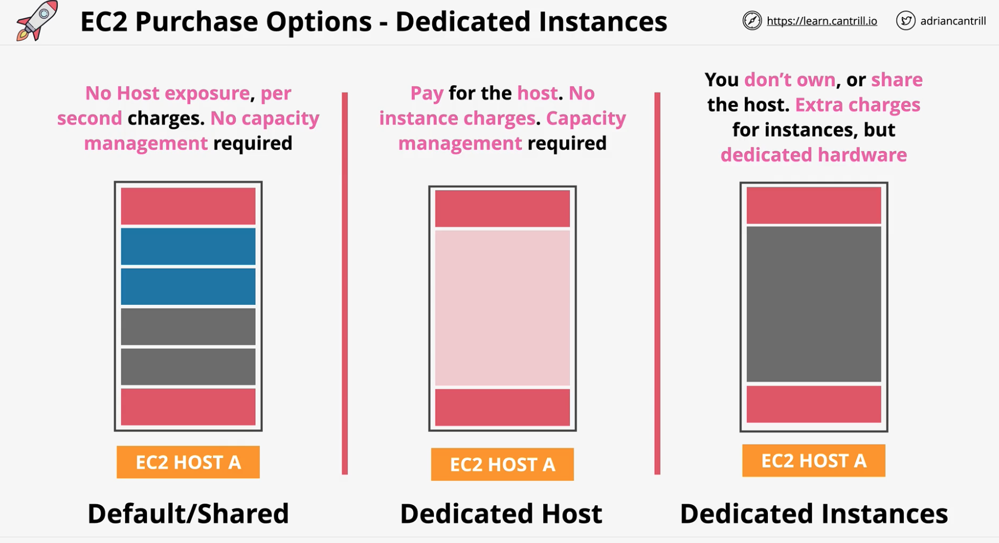

# EC2
- EC2 is virtualized VMs over physical services.
- Some advanced features come from cool advances virtualisation modes
- You need to memorize EBS performance and cost model

## Service matrix
Essence -> run Linux VPSe
Scope -> regional. Each instance goes into one subnet. All ENIs from same subnet.

Logical resources:
- Instance -> state, instance type, AMI, SSH keys
- Storage -> EBS volumes
- Network -> ENIs, Elastic IPs, SG

Main API operations -> CRUD over instance lifecycle

Important features configs:
- Instance type
- AMI
- Instance profile -> role
- Network config
- Storage config
- Purchase options (on-demand/spot/etc)
- Termination protection
- Placement group
- Launch templates -> preconfiged param list you use on launch

Cost model:
- runtime hours + storage
- unused elastic IPs
- unused ENIs

Integrations:
- IAM -> instance profile
- Route53 -> route traffic to it
- ALB -> load balancing
- ASG -> auto-scaling
- EBS/EFS -> storage
- CloudWatch -> metrics alarms
- S3 -> ami/snapshots
- SSM -> access & patching

# EC2 Architecture and Resilience

- EC2 instance = VM 
- EC2 = OS + Resources
- EC2 instances run on EC2 hosts -> Shared/Dedicated hosts
- Host runs always inside 1 AZ.
- Instance store = temporary. 
- Storage networking. Can connect via EBS. Volumes are allocated to instances.
- Data networking. When VM provisioned, its ENI is projected into a specific subnet. 
- Instances can have within same AZ ENI in diff subnets
- Instances stay on host when restarted. Switch host when: host fails, stop and then start -> move to host in same AZ
- You can do a migration of EC2 instance to another AZ, but need to run migration
- You can NEVER project ENI or connect to storage in another AZ

EC2 use cases:
- DEFAULT compute service. Can run any workload.
- Need OS level control
- Long running compute. No runtime limits. 24/7/365
- Server style apps
- Burst or steady-state load
- Monolithic application stacks
- Migration application workloads or Disaster Recovery

# Instance types
Choice driven by
- Resource type (CPU, RAM, GPU, FPGA, etc)
- Resource ratios -> cost optimisation
- Storage and network bandwidth (EBS is network based -> needs bandwidth)
- System architcture CPU/ Vendor
- Additional feature & capabilities -> GPU and other hardware stuff

Five categories:
- General purpose -> default choice
- Compute optimized -> HPC, ML, Media processing
- Memory optimized -> Memory intensive workloads, large in memory DS
- Accelarated computing -> GPU, FPGA -> best for niche
- Storage optimized -> super fast local storage, lots of IO. Data warehouses, elastics, DBs

Instance type
Each instance type always comes from a category
R5dn.8xlarge -> instance type name
R -> instance family.
5 -> generation -> AWS iterate often. Go for last generation always.
dn -> additional capabilities. maybe nothing here.
8xlarge -> instance size -> better to scale out(then up), its cheaper

# Instance connect
- So cool if you use it, no need to distribute private SSH key. 
- AZ delegate to AIM. No second security layer.
- SSH connection comes from non-your IP. 
- If want instance connect create SG which white lists all AWS IPs, so AWS can connect and nobody else can
- Allow connection only from a certain region of AWS. Use EC2_INSTANCE_CONNECT>

# Storage refresher
Key terms:
- Direct (local) attached storage = storage on the EC2 host. Fast, but ephemeral. Lost of host dies or VM moved
- Network attached storage = volumes delivered over the network (EBS). Resilient. Separate from host
- Emphemeral storage = non peristence
- Persistent storage = permanent storage. Outlives VM

Storage categories in AWS:
- Block storage = presented to the OS as collection of blocks .. no struct. Mountable. Bootable. Fixed-size chunk of bytes.
- Block storage = OS creates an FS on top. And then this is mounted. HDD or SDD provided. NO STRUCTURE BY DEFAULT.
- File storage = presented as a file share. Has structure. Mountable, NOT bootable. Multi-node share.
- Object storage = collection of objects, FLAT. Not mountable, not bootable. S3 example. Super scalable.

Storage performance
- Throughput = IO(block) size x IOPS
- IO(block) size -> size of the wheels -> size of a block 16Kb to 1Meg
- IOPS -> revolution speed of car wheels -> how many reads/writes per second
- Throughput -> end speed -> X MB/s
- Network can impact latency

# EBS

- EBS = block storage. Volume = addressable array of blocks.
- EBS = can be encrypted using KMS
- Instances see EBS as a block device and create a file system on top of it 
- Storage provisioned in ONLY ONE AZ. (Resilient in that AZ)
- EBS attached to EC2 via some network storge thingy
- Can do also multi-attach, but then you can have issue
- EBS should be for 1 instance.
- EBS can be saved to S3 as a snapshot. And then from here you can distribute this snapshot accross the region.
- EBS can provision various storage types (SSD/HDD), different sizes, performance profiles
- You are billed on GB-month mostly. There are also some exceptions.
- EBS replicates withing an AZ. Local failure OK, but if AZ down -> EBS volume down.

# EBS Volume Types
## General purpose
- gp2 -> default one -> 1Gb vs 16Tb -> IO credits (16Kb chunk in 1 second)
- you have 5.4 million IO credits in a bucket. And wth time it refills depending on perf rate of the volume
- bucket refills with min 100 IO credits per second regardless of volume size
- on top you get 3 IO credits per second per GB of volume size
- you can get a burst. also the bucket starts full.
- you need to manage bucket for each EBS
- for volumes larger than 1000GB credit system is not used and you always have baseline performance
- 16 000 IOPS per second is max
- Good for boot volumes, dev/test

- gp3 -> no credit bucket architecture -> 3000 IOPS per seconds, 125MiB/s -> 20% cheaper -> can buy 16000 IOPS or 1Gb/s
- 4x faster throughput than gp2
- gp3 is mostly better, just different cost model

## Provisioned IOPS
- io1/2 -> IOPS are independent of volume size
- 64 000 IOPS per volume -> 1Gb/s
- Block Express -> 256000 IOPS per volume, 4Gb/s
- Per instance performance -> there is per instance maximum -> need several EBSes to saturate instance max
- Super fast and high throughput performance !!!

## HDD Based
- st1/sc1 -> fast/slow 
- st1 -> sequential stuff, slower. 125Gb -> 16TB. 500 IOPS 1 MB blocks -> 500 Mb/s -> volume size limits
- st1 -> big data, data warehouse
- sc1 -> max economy, slow storage. Max 250Mb/s. Volume size limits
- sc1 -> 125Gb -> 16TB

# Instance store volumes

- Block storage devices
- Physically connected to one EC2 host
- Highest storage performance -> included in instance price
- Attached at launch, CANNOT attach after launch
- TEMPORARY STORAGE (!!). Assume lost on relaunch
- D3 -> can get 4.6 Gb/s throughput on instance store
- I3 -> 16Gb/s 
- Can do 2 million IOPS per volume sometimes -> crazy

# Choosing between EBS and instance store
EBS when:
- Persistent storage needed
- Resilient -> can also snapshot
- Storage isolated from instance lifecycle

Either way when:
- Need resilience, but app has strong replication -> could use instance store
- High performance needs ... it depends

Instance store when:
- Super high performance
- Cost

EXAM NOTES:
- Cheap -> go for ST1 or SC1 (HDD based)
- Throughput -> go for ST1
- Boot -> NOT ST1 or SC1. Cannot be used as boot volumes.
- GP2/3 -> up to 16 000 IOPS per volume.
- IO1/2 -> up to 64 000 IOPS per volume(*256,000 on Block Express) -> for large instance types
- Can create RAID0 from EBS volumes -> 260,000 IOPS (io1/2-BE,GP2/3) (260K IOPS is instance limit)
- More than 260K IOPS -> need to use instance store

# Snapshot, restore and fast snapshot restore FSR
- EBS snapshot = backup of EBS volume to S3
- Snapshots are INCREMENTAL copies. First snapshot = copy (take time), future snapshot = delta (fast)
- Can move snapshotes between accounts/regions
- If you delete a snapshot in the middle AWS kind of hides it and further snapshots continue to work
- Each snapshot is self-sufficient
- When creating volume = make blank or from snapshot
- Snapshot = move between AZs,Regions

Performance volumes:
- New EBS volume = full perf
- Snapshot restore = fetched gradually
- When requesting a file, then its a bit slowly loaded from S3
- You can force a read of every block to preload everything using a special tool -> like warmup
- FSR = Fast snapshot restore. Load snapshot to EBS instantly. Up to 50 per region. Set on Snap & AZ.
- FSR costs extra. Can manually force it with special tool. Cheaper
- Snapshots Gb/month costs. But this is only for used data, not for allocated.

# EBS encryption
- By default no encryption applied
- EBS encyprtion = removes risk from physical attack vector
- EBS uses KMS -> can use aws/ebs key or customer managed key
- Uses DEK for encryption stored with volume
- DEK is held in memory of EC2 instance and it decrypts
- Only stuff in RAM is decrypted
- Snapshots are also encrypted

EXAM NOTES:
- Accounts can be set to encrypt EBS volumes by default -> default KMS key
- Or chose KMS key
- Per volume 1 unique DEK is used -> snapshots use same DEK as main thingy
- Can't remove encryption, but can copy data to unecrypted volume
- OS is not aware of encryption no perf loss
- AES256 symmetrics encryption
- You can also make OS encrypt stuff if you want to hold keys. Software disk encryption.
- NO COST for encryption.

# Network interfaces, Instance IPs, DNS
- ENI has at least 1, which is primary
- You can attach more ENIs, but they must be in same AZ(can be diff subnets)
- All networking stuff is attached not to EC2, but to ENI, which is attached to it

ENI attributes:
- MAC address
- Primary IPv4 Private IP -> always 1 -> from this you also get DNS name ip-10-16-0-10.ec2.internal
- Can have 0 or more secondary IPv4 Private IPs
- 0 or 1 public Ipv4 addresses -> this is NOT fixed if automatically allocated via this way (restart doesn't change, stop/start do change)
- For public IP of the kind above you also get a DNS name like ec2-3-89-7-136.compute-1.amazonaws.com (this resolves to Private IP internally, to public IP externally)
- 1 Elastic IP per private IPv4 address -> elastic IP is diff from ordinary private IPv4 address
- 0 or more IPv6 addresses -> all public
- Security Groups -> applies to all IPs on this ENI
- Source/Destination checks -> discard packets if one filter not pass
- Secondary interfaces can be added (count depends on instance type), and these can be moved accross instances

Elastic IP
- Can associate with primary or secondary ENI
- If associate with primary, then this Elastic IP kicks out the Public IPv4 address. If elastic then removed, a new public Ip given

EXAM NOTES:
- Secondary ENI + MAC = Licensing -> can detach and attach and move between instances
- Multi-homed (subnets) management and data -> same EC2 can have ENI in two subnets (diff security groups)
- OS NEVER sees public IPv4 -> IGW does NAT
- IPv4 Public IPs are dynamic -> start&stop -> change
- Public DNS (gives this public IP) = private IP in VPC, public IP everywhere else

# AMI
- AMI = like a docker image but for EC2
- 
- AMI = used to launch EC2 instances
- AMI -> AWS or Community provided or Marketplace(extra cost for software)
- AMI are regional -> unique ID per region (same thing in diff regions different id)
- AMI are regional because depend on EBS volume snapshots
- By default only owner of AMI can use it, but can configure -> Public, Owner, Specific Accounts
- You can create an AMI from an existing instance

AMI lifecycle:
- Launch -> so you take an existing AMI. It has some EBS volumes attached to it.
- Configure -> then you configure it some more. and data is written is EBS
- Create image -> and then you take a snapshot an create AMI (AMI logical container(+metadata) over EBS volume snapshots)
- Launch -> launch again from image (when new instance launched -> EBS volumes created from AMI snapshots )

EXAM NOTES
- AMI is per region -> usable only in region
- AMI Baking -> create an AMI from a configured instance + adding your config on top and then save
- An AMI can't be edited -> launch instance -> update config -> make a new AMI
- Can be copied between regions
- Permissions = default only to your account
- Billed for S3 storage 

# EC2 Purchase options

Purchase options = launch types

## On-demand = default
- On-demand instances run on shared hardware and isolation is logical
- Per second billing when an instance is running (storage is billed on shutdown)
- Use this as default option. Move only if can justify.
- No interruptions. No discounts.
- Capacity reservations = none. No priority access.
- Good for short-term workloads. Unknown workloads. Apps which can't be interrupted.

## Spot - cheapest
- Spot = AWS selling unused capacity at a discount
- Can be interrupted with 2 minutes notice.
- You only ever pay for spot price. This can be upped. You always set how much max you want to pay.
- NEVER use for stuff which can't tolerate interruptions
- UC: Bursty capacity needs, non time critical, restartable, stateless stuff

## Reserved - long-term consistent
- You make long term commitment
- Gives a discount
- Unused reservations still billed
- Partial coverage of a larger instance
- Terms: 1 or 3 years
- No upfront = reduced per/s fee
- All upfront = no per/s fee -> max discount
- Partial upfront -> reduced per/s fee

## Dedicated host - buy the whole host
- You buy a physical machine
- No per/s charge
- You need to manage the capacity and think about it
- Useful for licensing
- Also host afinity is useful
- MAIN USE CASE: Socket and core licensing requirement

## Dedicated instances
- Your instances run on your unique host. Don't share host.
- You pay for dedicated instances and for hardware.

# Reserved instances continued
- Standard reduces -> the one above the classical one
- Scheduled reserved -> long-term, but only need 5h per day. Frequency, duration, and capacity. 1200h/per year min. 1 year min.

## Capacity reservation
- Reservations are served first
- Then on-demand
- Then spot

Capacity Reservations (no long term commitment, but also no discount)
- Regional
- Zonal
- On-demand capacity reservation -> you are prio, but pay the full price. cost for it

EC2 savings plan
- Hourly commitment for 1 or 3 year term
- A general compute $ amount (20$ per hour for 3 years) -> up to 66% discount
- Can create EC2 specific savings plan
- Always think about if you can use a savings plan
- Usable not only for EC2

# Instance status check and auto-recovery
- Similar to k8s probes

- 2 status checks -> system status/instances status -> 2 test packs
- System status = some host level problems
- Instance status = OS, network reachability issues
- You can manually restart instance to try and fix
- You can do auto-recovery -> configure it on the instance
- You configure it via "Create status check alarm" -> to alarm you can attach actions
- Auto-recovery -> will try to fix the issue itself -> works only in AZ. Only for modern instance types.
- Only works with EBS volumes thingies
- Can't fix everything

# Shutdown, terminate and termination protection
- You can put termination protection flag on an instance disableApiTermination flag
- You need a specific permission to disable Termination protection -> only for senior admins
- Shutdown behaviour -> stop or termination. Default is stop.

# Horizontal and vertical scaling
Scaling = grow or shrink

Vertical scaling
- This means resizing the instance type to get more resources
- There is a disruption, because reboot required -> reaction limits
- Larger instances -> non-linear cost increase
- Max instance = that's the top end
- No application modification required

Horizontal scaling
- Produces many small instances
- You need an LB for it
- Sessions = how do you maintain session state ???
- Requires app support or off-host session. App must not care to which instance it connects to
- No disruption when scaling out or in
- This one requires more thought
- No real limits
- Often less expensive
- More granular scaling

# Instance metadata
- Allows EC2 instance to get info about self and environment
- Similar to downstream API in K8S, which gives pods info about self 
- Available as HTTP call to http://169.254.169.254/latest/meta-data (EXAM NOTES! MEMORIZE !!!)
- Most common queried info to get info about networking
- Can get info about authentication -> can get  temp credentials
- Can pass temporary SSH keys
- User Data comes from here -> downloads script and runs
- NOT AUTHENTICATED AND NOT ENCRYPTED. Anyone who SSH in sees it.