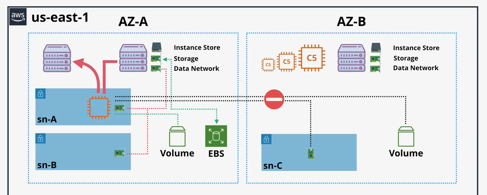
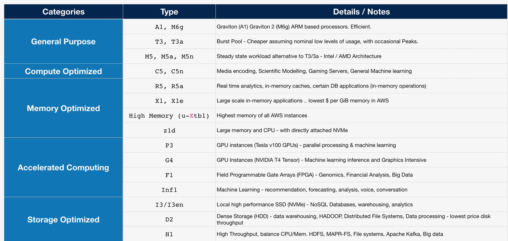
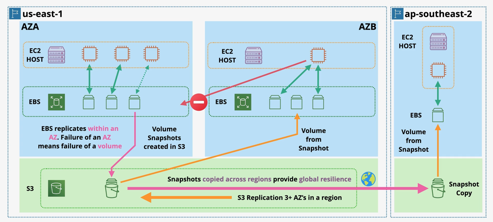

# EC2
- EC2 is virtualized VMs over physical services.
- Some advanced features come from cool advances virtualisation modes

## Service matrix
Essence -> run Linux VPSe
Scope -> regional. Each instance goes into one subnet. All ENIs from same subnet.

Logical resources:
- Instance -> state, instance type, AMI, SSH keys
- Storage -> EBS volumes
- Network -> ENIs, Elastic IPs, SG

Main API operations -> CRUD over instance lifecycle

Important features configs:
- Instance type
- AMI
- Instance profile -> role
- Network config
- Storage config
- Purchase options (on-demand/spot/etc)
- Termination protection
- Placement group
- Launch templates -> preconfiged param list you use on launch

Cost model:
- runtime hours + storage
- unused elastic IPs
- unused ENIs

Integrations:
- IAM -> instance profile
- Route53 -> route traffic to it
- ALB -> load balancing
- ASG -> auto-scaling
- EBS/EFS -> storage
- CloudWatch -> metrics alarms
- S3 -> ami/snapshots
- SSM -> access & patching

# EC2 Architecture and Resilience

- EC2 instance = VM 
- EC2 instances run on EC2 hosts -> Shared/Dedicated hosts
- Host runs always inside 1 AZ.
- Instance store = temporary. 
- Storage networking. Can connect via EBS. Volumes are allocated to instances.
- Data networking. When VM provisioned, its ENI is projected into a specific subnet. 
- Instances can have within same AZ ENI in diff subnets
- Instances stay on host when restarted. Switch host when: host fails, stop and then start -> move to host in same AZ
- You can do a migration of EC2 instance to another AZ, but need to run migration
- You can NEVER project ENI or connect to storage in another AZ
- EC2 = OS + Resources

EC2 use cases:
- DEFAULT compute service. Can run any workload.
- Need OS level control
- Long running compute. No runtime limits. 24/7/365
- Server style apps
- Burst or steady-state load
- Monolithic application stacks
- Migration application workloads or Disaster Recovery

# Instance types
Choice driven by
- Resource type (CPU, RAM, GPU, FPGA, etc)
- Resource ratios -> cost optimisation
- Storage and network bandwidth (EBS is network based -> needs bandwidth)
- System architcture CPU/ Vendor
- Additional feature & capabilities -> GPU and other hardware stuff

Five categories:
- General purpose -> default choice
- Compute optimized -> HPC, ML, Media processing
- Memory optimized -> Memory intensive workloads, large in memory DS
- Accelarated computing -> GPU, FPGA -> best for niche
- Storage optimized -> super fast local storage, lots of IO. Data warehouses, elastics, DBs

Instance type
Each instance type always comes from a category
R5dn.8xlarge -> instance type name
R -> instance family.
5 -> generation -> AWS iterate often. Go for last generation always.
dn -> additional capabilities. maybe nothing here.
8xlarge -> instance size -> better to scale out(then up), its cheaper

# Instance connect
- So cool if you use it, no need to distribute private SSH key. 
- AZ delegate to AIM. No second security layer.
- SSH connection comes from non-your IP. 
- If want instance connect create SG which white lists all AWS IPs, so AWS can connect and nobody else can
- Allow connection only from a certain region of AWS. Use EC2_INSTANCE_CONNECT>

# Storage refresher
Key terms:
- Direct (local) attached storage = storage on the EC2 host. Fast, but ephemeral. Lost of host dies or VM moved
- Network attached storage = volumes delivered over the network (EBS). Resilient. Separate from host
- Emphemeral storage = non peristence
- Persistent storage = permanent storage. Outlives VM

Storage categories in AWS:
- Block storage = presented to the OS as collection of blocks .. no struct. Mountable. Bootable. Fixed-size chunk of bytes.
- Block storage = OS creates an FS on top. And then this is mounted. HDD or SDD provided. NO STRUCTURE BY DEFAULT.
- File storage = presented as a file share. Has structure. Mountable, NOT bootable. Multi-node share.
- Object storage = collection of objects, FLAT. Not mountable, not bootable. S3 example. Super scalable.

Storage performance
- Throughput = IO(block) size x IOPS
- IO(block) size -> size of the wheels -> size of a block 16Kb to 1Meg
- IOPS -> revolution speed of car wheels -> how many reads/writes per second
- Throughput -> end speed -> X MB/s
- Network can impact latency

# EBS

- EBS = block storage. Volume = addressable array of blocks.
- EBS = can be encrypted using KMS
- Instances see EBS as a block device and create a file system on top of it 
- Storage provisioned in ONLY ONE AZ. (Resilient in that AZ)
- EBS attached to EC2 via some network storge thingy
- Can do also multi-attach, but then you can have issue
- EBS should be for 1 instance.
- EBS can be saved to S3 as a snapshot. And then from here you can distribute this snapshot accross the region.
- EBS can provision various storage types (SSD/HDD), different sizes, performance profiles
- You are billed on GB-month mostly. There are also some exceptions.
- EBS replicates withing an AZ. Local failure OK, but if AZ down -> EBS volume down.

# EBS Volume Types
## General purpose
## Provisioned IOPS
## HDD Based

# Instance store volumes
# Choosing between EBS and instance store
# Snapshot, restore and fast snapshot restore FSR
# EBS encryption
# Network interfaces, Instance IPs, DNS
# AMI
# EC2 Purchase options
# Reserved instances
# Instance status check and auto-recovery
# Shutdown, terminate and termination protection
# Horizontal and vertical scaling
# Instance metadata