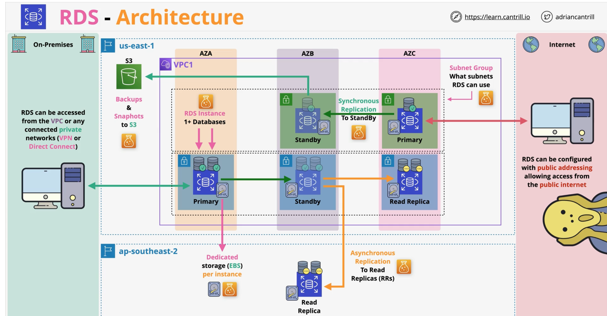

# RDS
- RDS does 6 engines, but ALL are relational DBs 
- All big ones supported = MySQL, PostgreSQL, MariaDB, Oracle, SQL Server, Aurora (MySQL- and PostgreSQL-compatible
- For NoSQL DBs use other services

# Database refresher
- DBs = SQL(schema rigid+relationships rigid) + NoSQL(everything which is not relational, weak/no schema, weak relationships)
- NoSQL database contains: key-value, wide-column,document, columnar, graph

# ACID vs BASE
- Need ACID -> RDS/Aurora
- Need BASE -> DynamoDB

# Databases on EC2
- Kind of a bad practice. Requires justification

Pros:
- Access to OS of the DB instance. Sometimes happens. Question this.
- Advanced DB tuning options. But you can control a lot also via RDS. Question this.
- DB or DB Version which AWS doesn't provide
- Specific OS/DB Combination which AWS doesn't provide
- Architecture AWS doesn't provide (replication/resilience)
- Decision makers just want it

Cons:
- Admin overhead -> managing EC2 and DbHost
- Backup/DR management
- EC2 is single AZ
- Features -> some of AWS DB products are amazing
- EC2 is ON or OFF -> no serverless, no easy scaling
- Replication -> AWS makes it easier
- Performance -> AWS tries to optimize it

# RDS Architecture

- Database server as a service -> multiple databases on one service
- Amazon Aurora != RDS
- No access to OS or SSH access(except for RDS Custom)

Costs:
- Instance size & type -> similar to EC2
- Multi AZ or not 
- Storage type & amount
- Data transfer costs
- Backups & snapshots - Gb/month costs
- DB licencing costs

# RDS Multi-AZ instance and cluster
- Instance -> classic variant. 1 primary + 1 standby (2AZs)
- Cluster -> 1 writer + 2 readable standbys (3AZs)

# RDS auto backup, RDS snapshot, RDS restore
- Gives you nice UI and better backup process/guarantees

# RDS read replicas
- You can create one-click replicas of your DBs

- They do async replication (might be small lag)
- App knows nothing about read replicas
- You can create cross-region replication like this
- You can create 5x read replicas
- Read replicas can have their own replicas (lag issue!!)
- Can help solve global availability
- Snapshots & Backups improve RPO 
- RTO are a problem. Read replica can be quickly promoted to main and fast resolve of issue.
- Doesn't help with DATA CORRUPTION
- Read only until promotion
- Globa resilience -> replicate to another region and then restore from there.

# RDS data security
- Checklist of best practices you need to follow for an RDS instance on AWS

- AN -> can do IAM user auth. AZ is fully internal for DB.
- Encryption-in-transit -> can be made mandatory
- Encryption-at-rest -> KMS done by HOST/EBS

# RDS custom
- RDS custom = middle ground between RDS and self-managing a database on EC2.

# Aurora architecture
- Aurora is a bit more expensive, but replication/failover are faster. Storage auto growth no need to manage EBS volumes.

# Aurora serverless
- Aurora serverless = Aurora with capacity that scales automatically instead of you picking an instance class

# Aurora global database
- Aurora global database = one primary region plus secondary regions, with replication at the storage layer rather than logical replication
- Primary region = read/write, secondary regions = read-only (up to 16 replicas each)

# Multi-master writes
- Aurora can do multi-master writes -> no failover needed if one fails

# RDS proxy
- RDS proxy = managed connection pooler sitting between your app and RDS/Aurora, inside your VPC
- Not super useful for SpringBoot(already solves problem), hyper useful for Lambdas

# DMS 
- Allows to simplify migrations between similar or different DB types

- The Database Migration Service (DMS) is a managed service which allows for 0 data loss, low or 0 downtime migrations between 2 database endpoints.
- One endpoint must be on AWS
- Source DB and Target DB -> need to move data between them
- DMS uses a replication instance -> which has 0 or more replication tasks. Several can be run

Job types:
- Full load migration -> one off migration of data (if you can afford a maintenance window)
- Full load + CDC migration -> initially do a bulk load and then replicate diff
- CDC only -> if you want to do bulk part with native tooling

- SCT = schema conversion tool
- SCT -> can do schema conversion between various DB types
- SCT is not used for migrations between DBs of same type MySQL on-prem -> RDS MySQL
- DMS can integrate with snowballs. SCT loads into snowball, snowball to S3, DMS does S3 to target DB. And then CDC the diff.
